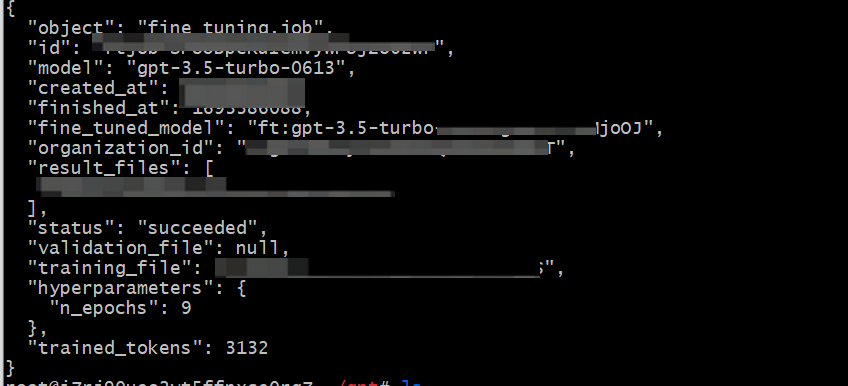
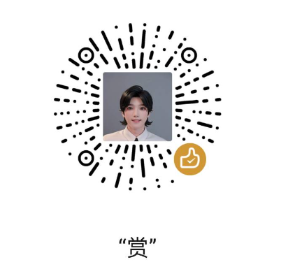

1、运行test.py，读取test.jsonl，检查是否有错误，以及消耗token
```
python test.py
```
2、训练
```
python train.py
```
3、训练完后，通过openai.FineTuningJob.retrieve()查看信息，如果成功，可以从fine_tuned_model字段中获取训练好的模型信息

4、如果运行train.py打印`fine_tuned_model:null`，那是openai在进行训练。
等上一段时间运行print_fine_tuned_model.py，再次获取训练的模型。
修改print_fine_tuned_model.py里的fid，fid是train.py的openFT.id

```
python print_fine_tuned_model.py
```
5、使用微调模型
```
python use_model.py
```

# 请我喝杯奶茶


# 关注公众号“科技探幽”